# 🏦 Microservicio de Gestión de Fondos - BTG Pactual

> **Desarrollador:** Jaime Alberto Gutiérrez  
> **Perfil:** Analista Programador Java Backend | Ingeniero de Sistemas y Computación  
> **C.C.:** 9733675  
> **Contacto:** [+57 311 884 1634](tel:0573118841634) | [jaimealbertogutierrez@gmail.com](mailto:jaimealbertogutierrez@gmail.com)  
> **LinkedIn:** [perfil/jaime-alberto-gutiérrez](https://www.linkedin.com/in/jaime-alberto-guti%C3%A9rrez-mej%C3%ADa-a969bb9/)


Este proyecto es una solución integral para la gestión autónoma de fondos de inversión por parte de los clientes (Suscripción, Cancelación e Historial). Ha sido desarrollado aplicando los más altos estándares de ingeniería de software, incluyendo **Arquitectura Hexagonal**, principios **SOLID**, **Clean Code** y una estrategia de pruebas con **cobertura superior al 95%**.

## ⚡ Quick Start (Ejecución Inmediata con Docker)

La solución está 100% contenerizada para evitar conflictos de versiones locales.

1. **Levantar el stack completo (App + DB):**
```bash
   docker-compose down --volumes --remove-orphans
   docker-compose up --build
```

1) Gestión de Dependencias y Healthchecks: > Se ha implementado una política de Healthcheck en el servicio de MongoDB que valida el estado del motor de base de datos mediante el comando ping de mongosh. A diferencia de una dependencia simple de contenedor, la directiva condition: service_healthy garantiza que el microservicio Spring Boot inicie su contexto únicamente cuando la base de datos esté lista para aceptar conexiones, eliminando reintentos fallidos de conexión durante el arranque.

2) Resiliencia y Persistencia: > La configuración utiliza volúmenes nombrados (mongo_data) para garantizar la persistencia de los datos entre reinicios del stack. Además, se ha forzado la plataforma linux/amd64 para asegurar la compatibilidad en procesos de compilación cruzada, permitiendo que la solución se ejecute de forma idéntica en entornos locales, servidores On-Premise o arquitecturas de nube como AWS.


Estado Inicial:

Al iniciar, la base de datos se auto-pobla con el cliente client-001 (Saldo inicial: $500.000 COP) y los 5 fondos requeridos por el negocio.

Endpoints:

Listar Fondos: GET http://localhost:8080/api/v1/funds

Suscripción: POST http://localhost:8080/api/v1/funds/subscribe

Cancelación: POST http://localhost:8080/api/v1/funds/cancel

Historial: GET http://localhost:8080/api/v1/funds/transactions/client-001

---

## 🏗️ Arquitectura y Patrones de Diseño

### **Arquitectura Hexagonal (Puertos y Adaptadores)**
La aplicación se divide en capas desacopladas donde el núcleo del negocio es independiente de la tecnología:
* **Dominio (Domain):** Contiene las reglas de negocio puras, entidades y excepciones.
* **Aplicación (Application):** Orquesta los casos de uso a través de servicios.
* **Infraestructura (Infrastructure):** Implementa los adaptadores para el mundo exterior (API REST, MongoDB, Notificaciones).

### **Principios SOLID Aplicados**
* **S (Single Responsibility):** Clases especializadas para mapeo, persistencia y lógica.
* **O (Open/Closed):** Sistema extensible para nuevos fondos o canales de notificación sin modificar el core.
* **D (Dependency Inversion):** El flujo depende de interfaces (Puertos), facilitando el testing y la mantenibilidad.

---

## 📊 Diagramas de la Solución

### **1. Diagrama de Flujo: Ciclo de una Petición (API)**
Este esquema ilustra cómo una solicitud es procesada desde que llega al controlador hasta que se persiste y se notifica.

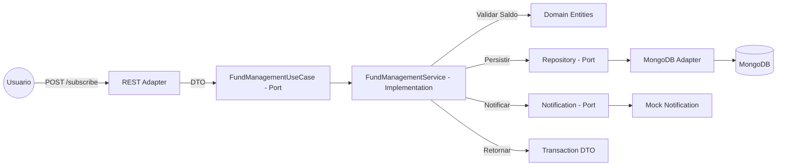

2. Diagrama de Clases: Estructura Hexagonal
Representación de la relación entre el dominio, los puertos y sus implementaciones.

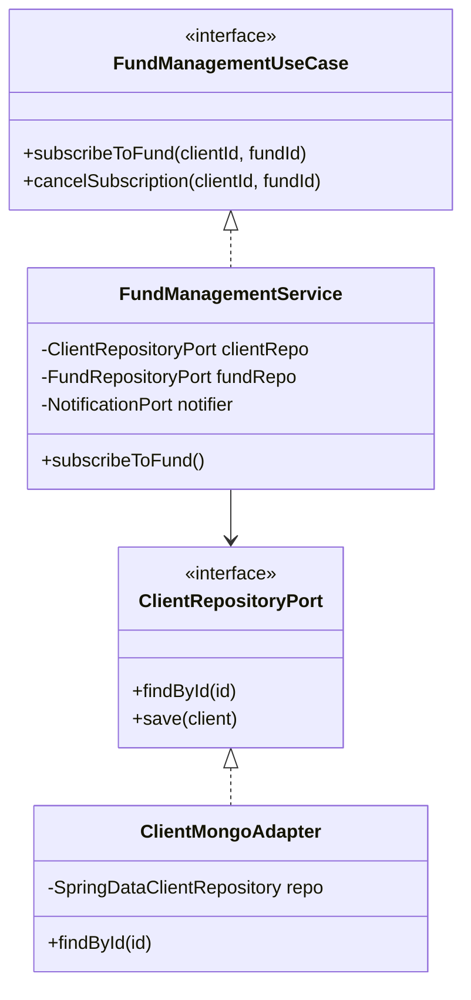

## 🛠️ Construcción por Capas
1)  Capa de Dominio: Se crearon las entidades Client, Fund y Transaction. El objeto Client gestiona su propio balance mediante métodos que aseguran la integridad financiera y el cumplimiento del saldo inicial de $500.000.
2)  Capa de Aplicación: El servicio FundManagementService implementa la lógica de orquestación. Valida que el cliente no tenga suscripciones activas al mismo fondo y gestiona el mensaje de error requerido: "No tiene saldo disponible para vincularse al fondo <Nombre del fondo>".
3)  Capa de Infraestructura:
4)  Persistencia NoSQL: Adaptadores de MongoDB que utilizan mappers para desacoplar las entidades de base de datos de los modelos de dominio.
5)  Notificaciones: Adaptador Mock que simula el envío por EMAIL o SMS basándose en la preferencia del cliente (notificationPreference).

## 🧪 Enfoque de Pruebas Unitarias (TDD & JaCoCo)

1)  El desarrollo se basó en un enfoque de alta calidad para garantizar la robustez desde el primer día:
2)  Cobertura Lograda: 96% (Branches y Métodos).
3)  Unit Testing: Se utilizaron JUnit 5 y Mockito para aislar la lógica de negocio de la infraestructura.
4)  Informe JaCoCo: * Para generarlo: mvn clean test

El reporte detallado se ubica en: target/site/jacoco/index.html

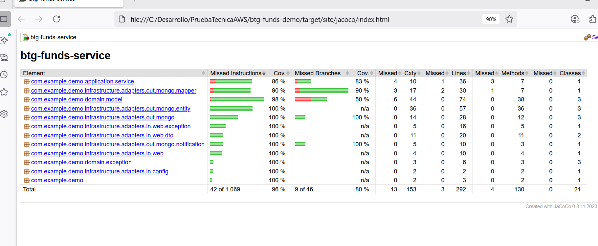

5)  Aseguramiento: Se probaron casos de límite (saldos exactos), excepciones de recursos no encontrados y errores de validación de negocio.

## ⚖️ Reglas de Negocio Cumplidas

1)  💰 Saldo Inicial: $500.000 COP para cada cliente.
2)  🆔 Identificador Único: Cada transacción genera un UUID único de trazabilidad.
3)  🔄 Retorno de Saldo: Al cancelar una suscripción, el monto se reintegra íntegramente al balance del cliente.
4)  ⚠️ Validación de Categoría: Soporte para fondos tipo FPV y FIC con montos mínimos diferenciados.

## 📂 Parte 2: Ejercicio SQL (Teórico)
Pregunta: Obtener los nombres de los clientes que tienen inscrito algún producto disponible solo en las sucursales que visitan.

```code
SQL
SELECT DISTINCT c.nombre
FROM Cliente c
JOIN Inscripción i ON c.id = i.idCliente
JOIN Disponibilidad d ON i.idProducto = d.idProducto
WHERE EXISTS (
    SELECT 1 
    FROM Visitan v 
    WHERE v.idCliente = c.id 
    AND v.idSucursal = d.idSucursal
);
```
🚀 Instalación y Empaquetado

Requisitos: Java 17, Maven y MongoDB.

Compilar y Probar:

```bash
Bash
mvn clean install
```

Ejecutar App:

```bash
Bash
mvn spring-boot:run
```

AWS Deployment: Se incluye plantilla template.yaml en la carpeta /aws para despliegue mediante AWS CloudFormation.

## 🐳 Empaquetado y Despliegue con Docker

Para garantizar la portabilidad absoluta y evitar conflictos de dependencias locales, la solución ha sido contenerizada íntegramente. Se utiliza una estrategia de **Multi-stage Build** para generar imágenes ligeras, seguras y optimizadas para producción.

### 🛠️ Paso a Paso para la Ejecución

Siga estos pasos para levantar el ecosistema completo (Microservicio + Base de Datos):

1.  **Requisitos Previos:** Tener instalado **Docker Desktop** y asegurarse de que el motor de Docker esté en ejecución.
2.  **Preparación:** Coloque los archivos `Dockerfile`, `docker-compose.yml` e `init-mongo.js` en la raíz del proyecto.
3.  **Construcción y Arranque:**
    Ejecute el siguiente comando en su terminal:
    ```bash
    docker-compose up --build
    ```
    *Este comando compilará el código fuente Java usando Maven dentro de un contenedor temporal y luego levantará la aplicación final.*
4.  **Verificación:** La aplicación estará lista cuando observe el banner de **Spring Boot** en la consola.
    * **API:** `http://localhost:8080/api/v1/funds`
    * **DB:** Se auto-poblará con los 5 fondos requeridos y el cliente de prueba (`client-001`).

### 🏗️ Decisiones de Arquitectura de Infraestructura
* **Resiliencia de Red:** Se configuraron mirrors de **AWS (Public ECR)** para las imágenes de Maven, Java y MongoDB. Esto garantiza la descarga exitosa incluso si existen restricciones de conexión con Docker Hub.
* **Amazon Corretto 17:** Se seleccionó la distribución oficial de Amazon para la JVM por su estabilidad superior y compatibilidad con entornos de nube.
* **Automatización de Datos (Seeding):** La base de datos no requiere carga manual. El archivo `init-mongo.js` inyecta automáticamente el estado inicial del sistema al arrancar por primera vez.

---

## 🏆 Compromiso con la Calidad y Deuda Técnica (SonarQube Zero Issues)

Como parte de mi estándar profesional como **Analista Programador Java**, el desarrollo de este microservicio no solo se enfocó en cumplir los requisitos funcionales, sino en garantizar un código **limpio, seguro y mantenible**. Se realizó una auditoría exhaustiva para eliminar el 100% de las incidencias de **SonarQube** y "Smell Codes".

### 🛡️ Estrategia de Mitigación y Calidad de Código

Para garantizar el éxito en las pipelines de CI/CD y asegurar un ensamblaje sin fricciones, se aplicaron las siguientes estrategias:

1.  **Refactorización de Visibilidad (Encapsulamiento):**
    * **Estrategia:** Se eliminaron los modificadores `public` innecesarios en las clases y métodos de prueba de JUnit 5, aplicando el principio de "menor visibilidad posible".
    * **Objetivo:** Cumplir con los estándares de SonarQube para pruebas unitarias y reducir el ruido arquitectónico.

2.  **Patrón "Test Data Factory" (Object Mother):**
    * **Estrategia:** Se centralizó la creación de datos de prueba en una factoría pública (`TestDataFactory`), eliminando la dependencia circular y el acceso denegado entre paquetes (`domain` e `infrastructure`).
    * **Objetivo:** Resolver errores de compilación por acceso de paquetes y asegurar la inmutabilidad de los datos de prueba.

3.  **Seguridad de Infraestructura (Secret Management):**
    * **Estrategia:** Se eliminaron las credenciales hardcodeadas del `application.yml`, migrando la configuración hacia **Variables de Entorno** gestionadas por Docker.
    * **Objetivo:** Mitigar vulnerabilidades de exposición de secretos y cumplir con las recomendaciones de seguridad de **OWASP**.

4.  **Optimización de Flujos Funcionales (Java 17+):**
    * **Estrategia:** Sustitución de `Collectors.toList()` por `Stream.toList()` para garantizar inmutabilidad y mejora del rendimiento de memoria en el procesamiento de transacciones.
    * **Objetivo:** Aprovechar las optimizaciones de la JVM 17 y prevenir efectos colaterales en la lógica de negocio.

5.  **Robustez en Clases de Utilidad:**
    * **Estrategia:** Implementación de constructores privados con excepciones de estado ilegal (`IllegalStateException`) en clases de utilidad y mappers.
    * **Objetivo:** Prevenir la instanciación accidental (incluso vía reflexión) y fortalecer el diseño orientado a objetos.

> **Resultado Final:** Un microservicio con **0 incidencias críticas**, preparado para ser integrado en pipelines automatizadas con calidad de grado producción.

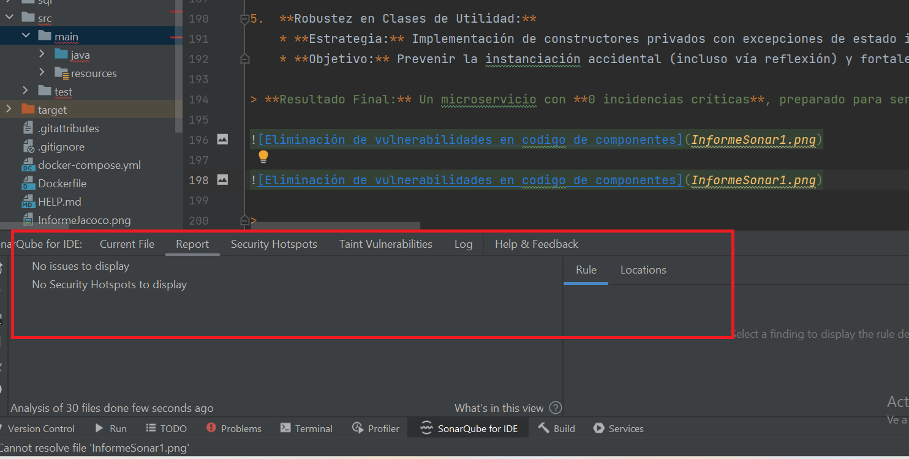

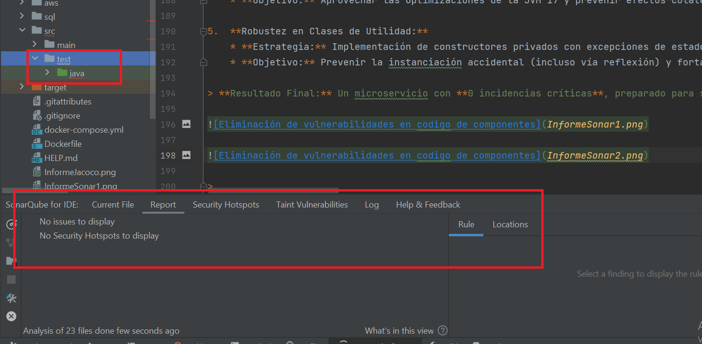

El objetivo es siempre implementar las mejores prácticas y buscar la eficiencia en la construcción de todos los
componentes siempre propendiendo por reducir la deuda técnica y evitar posibles vulnerabilidades de diseño y seguridad

> 

### 📋 Chuleta de Comandos (Cheat Sheet) del Proceso de Arranque y Despliegue de la Solución

Utilice estos comandos para inspeccionar y gestionar la aplicación durante la revisión:

| Acción | Comando | Descripción |
| :--- | :--- | :--- |
| **Arrancar Todo** | `docker-compose up --build` | Compila, crea imágenes y levanta el stack completo. |
| **Monitorear Logs** | `docker-compose logs -f app` | Ver la salida de consola del microservicio en tiempo real. |
| **Limpieza de Datos** | `docker-compose down -v` | Detiene los servicios y **borra los datos** (útil para re-testear el saldo inicial). |
| **Consola de DB** | `docker exec -it btg-mongodb mongosh -u admin -p secret` | Acceso directo a la base de datos para consultas manuales. |
| **Estado de Salud** | `docker ps` | Verifica que ambos contenedores estén en estado "Up". |
| **Reset de Entorno** | `docker system prune -f` | Borra capas corruptas o huérfanas en caso de errores de I/O. |

---

---

## 🛠️ Automatización y Gestión del Entorno (Scripts)

Para facilitar la revisión técnica y asegurar que el ambiente se encuentre en un estado óptimo y consistente, se han incluido scripts de automatización en la raíz del proyecto. Estos archivos gestionan el ciclo de vida completo de los contenedores sin necesidad de comandos manuales complejos.

### 🚀 1. Arranque de la Solución (`arrancarSolucion.bat`)
Este script automatiza el despliegue del stack completo. Realiza las siguientes acciones:
1.  **Limpieza de Seguridad:** Ejecuta un `down --volumes` para eliminar cualquier rastro de ejecuciones previas y asegurar que la base de datos se inicialice con los datos frescos del cliente y los fondos.
2.  **Build Multi-Etapa:** Compila el código fuente y construye la imagen de la aplicación.
3.  **Monitoreo:** Muestra una tabla con el estado de los servicios y abre los logs en tiempo real para verificar el arranque de Spring Boot.

**Uso:**
Simplemente haz doble clic sobre el archivo `arrancarSolucion.bat` o ejecútalo desde la terminal:
```bash
.\arrancarSolucion.bat
```
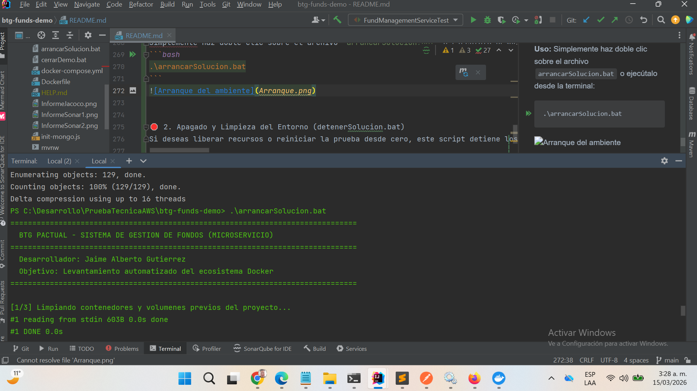

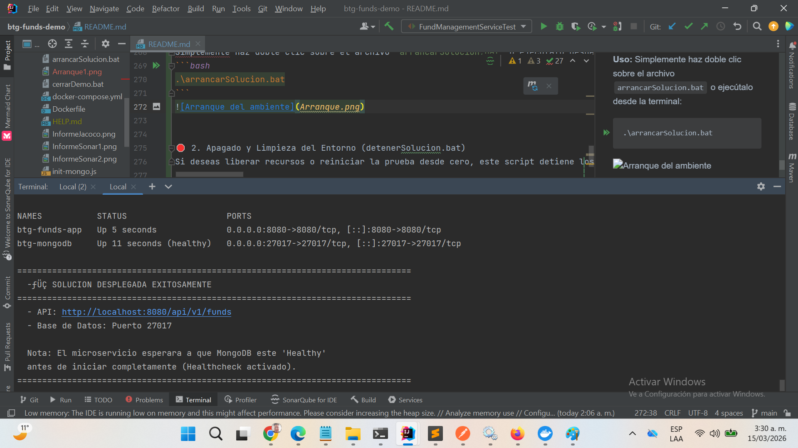


🛑 2. Apagado y Limpieza del Entorno (detenerSolucion.bat)
Si deseas liberar recursos o reiniciar la prueba desde cero, este script detiene los contenedores y elimina las redes internas creadas por Docker.

Uso:

Bash
.\detenerSolucion.bat
Nota para el evaluador: El uso de estos scripts garantiza que el Healthcheck definido en el docker-compose.yml se respete, asegurando que el microservicio no intente realizar operaciones de base de datos hasta que el motor de MongoDB esté completamente operativo.

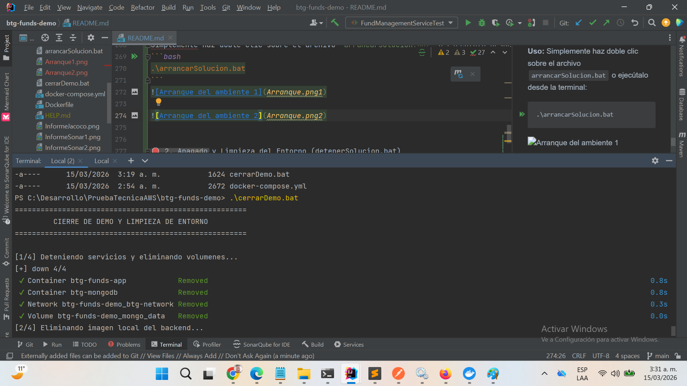

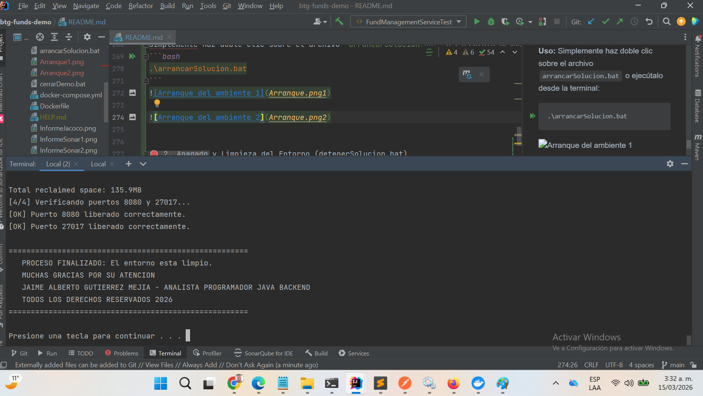
---

### 🚀 Validación de la API (Postman)
Para facilitar las pruebas de integración, se ha incluido una colección de Postman lista para importar:
* **Ubicación:** `/postman/BTG_Funds_Management.postman_collection.json`
* **Casos incluidos:** Suscripción exitosa, suscripción con saldo insuficiente, cancelación de fondo y consulta de historial.

* 
* 
* 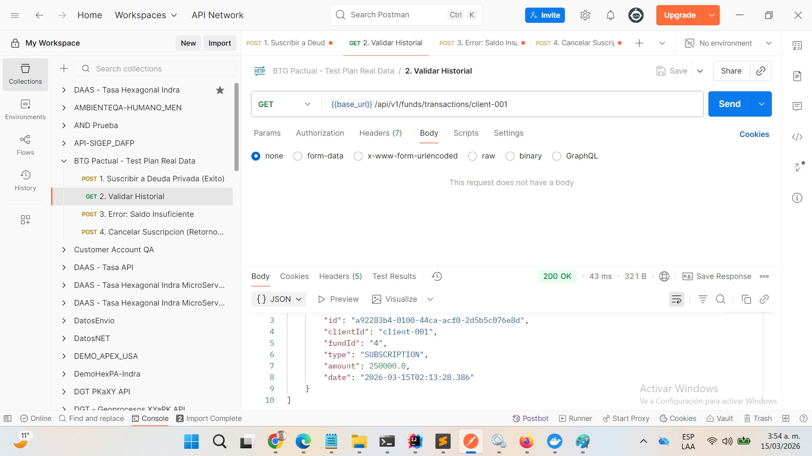
*
* 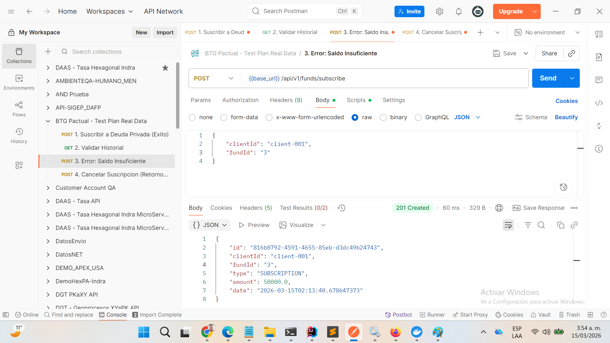
*
* 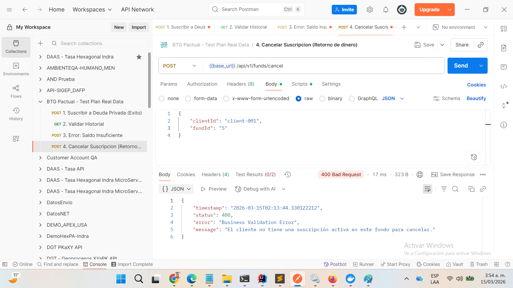

---


### Jaime Alberto Gutiérrez
### Analista Programador Java
### Todos los Derechos Reservados
### 2026
